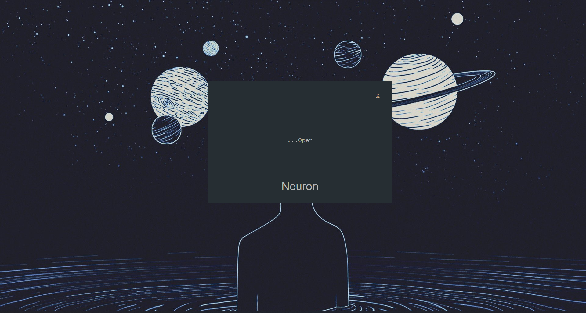
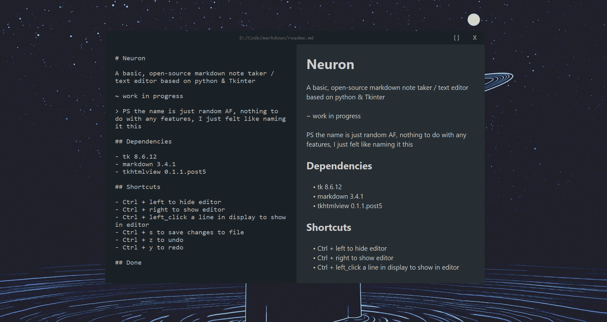

# Neuron

A basic, open-source markdown note taker / text editor based on python & Tkinter

~ work in progress

> PS the name is just random AF, nothing to do with any features, I just felt like naming it this

## Dependencies

- tk 8.6.12
- markdown 3.4.1
- tkhtmlview 0.1.1.post5

## Shortcuts

- Ctrl + left to hide editor
- Ctrl + right to show editor
- Ctrl + left_click a line in display to show in editor
- Ctrl + s to save changes to file
- Ctrl + z to undo
- Ctrl + y to redo

## Theme Customization

The theme of the program is controled by the `styles` file with a `python dictionary` that describes the theme. You can control the colors, fonts and text sizes of the entire program by replacing the default styles dictionary by your own custom one.

## Pending

- Text editor widget
  - add line numbering
  - add menus to title bar
  - persistance to reopen a previously opened file
  - add syntax highligting
- Display Widget
  - add support for more tags

- PDF export
- HTML Export (control style with CSS)
- Connect to google drive (maybe more cloud providers later if i feel like it)
- Tree view of files in the notes folder
